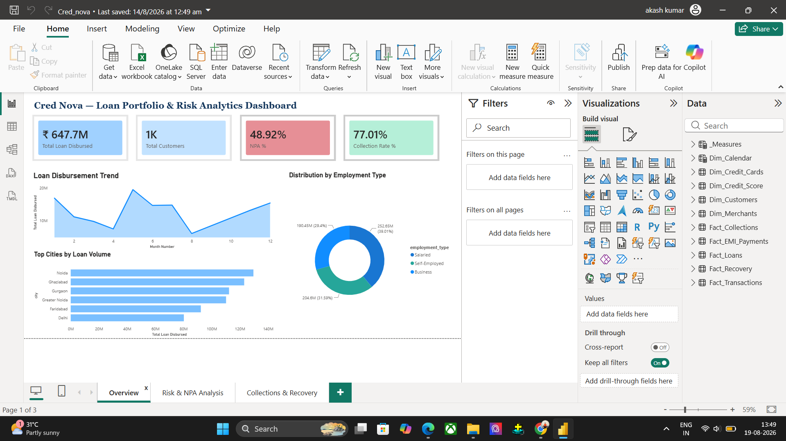
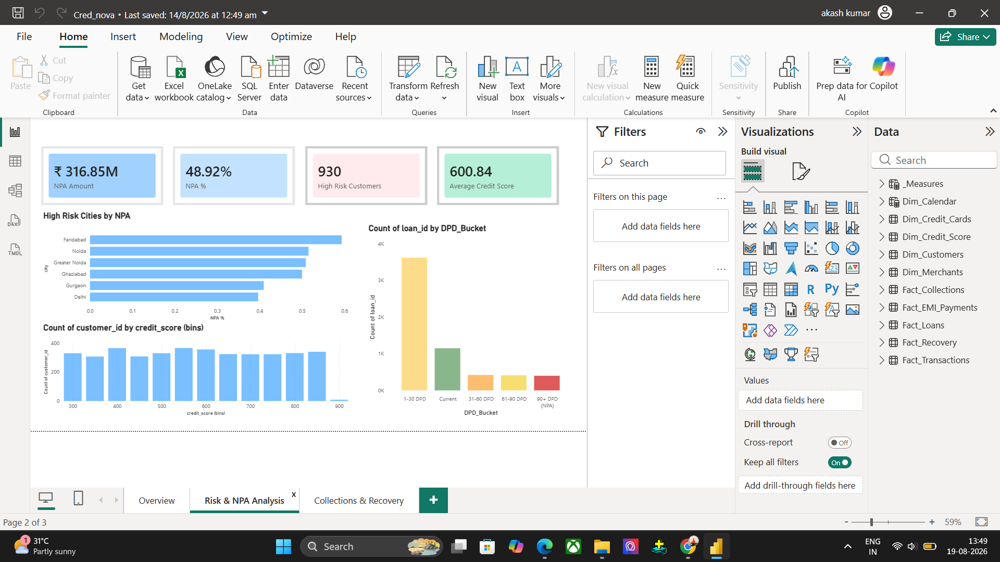
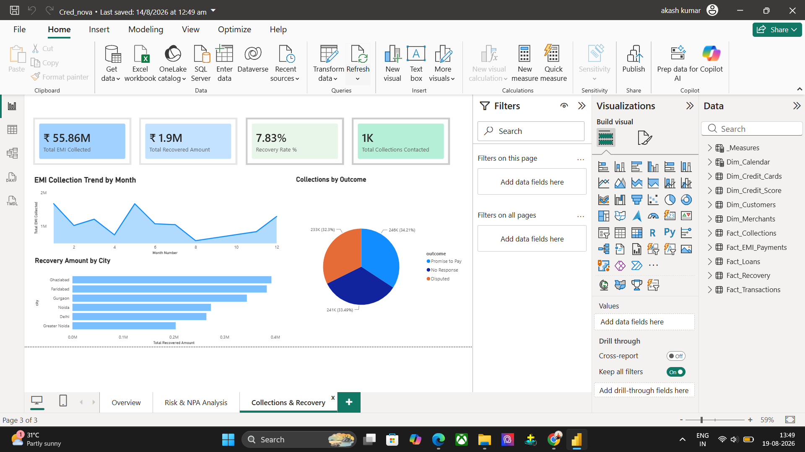

# Cred Nova — Loan Portfolio & Credit Risk Analytics Dashboard

A Power BI dashboard built for a bank/NBFC Risk Management team to monitor loan portfolio health, identify delinquent and NPA-risk customers, and track Collections & Recovery performance — powered by a SQL Server backend and a Star Schema data model.

---

## 📌 Project Overview

Banks and NBFCs need to continuously monitor how well their loan book is performing — which customers are falling behind on payments, how much of the portfolio is turning into a Non-Performing Asset (NPA), and how effective the Collections and Recovery teams are at recovering that money.

**Cred Nova** is an end-to-end analytics solution that answers exactly these questions through three purpose-built dashboard pages, backed by a normalized SQL Server database and a set of business-critical DAX measures.

---

## 🎯 Business Problem

| Question | Answered By |
|---|---|
| How large is our loan portfolio, and where is it concentrated? | Overview Page |
| Which loans are turning into NPAs, and where is the risk concentrated? | Risk & NPA Analysis Page |
| How effective are our Collections and Recovery efforts? | Collections & Recovery Page |

---

## 🛠️ Tech Stack

- **SQL Server (T-SQL)** — Database design, synthetic data generation, SQL Views
- **Power Query (M)** — Data cleaning and transformation
- **Power BI** — Data modeling, DAX measures, dashboard design
- **DAX** — Business logic and KPI calculations

---

## 🗂️ Data Model (Star Schema)

The model follows a **Fact Constellation (Galaxy Schema)** — multiple Fact tables representing different business processes (loan disbursement, EMI payments, collections, recovery), sharing common Dimension tables.

**Fact Tables**
- `Fact_Loans` — Loan disbursement records (amount, interest rate, tenure, status)
- `Fact_EMI_Payments` — Monthly EMI due/paid records with DPD (Days Past Due)
- `Fact_Collections` — Collections team contact attempts and outcomes
- `Fact_Recovery` — Post-charge-off recovery records

**Dimension Tables**
- `Dim_Customers` — Customer demographics, income, employment type
- `Dim_Credit_Score` — Customer credit score history
- `Dim_Calendar` — Dynamically generated date table (built with `CALENDAR()` in DAX) for time intelligence

**Relationships**: One-to-many relationships connect each Dimension to its related Facts; `Dim_Calendar` connects to `Fact_EMI_Payments` for time-based trend analysis.

---

## 🔧 Data Preparation

**SQL Server**
- Designed a normalized schema with Primary Key / Foreign Key relationships
- Generated realistic synthetic banking data at scale using set-based T-SQL generation (`NEWID()`, `CHECKSUM()`, `CASE WHEN`) instead of manual entry or row-by-row loops
- Built SQL Views (`vw_Loan_Portfolio`, `vw_EMI_Repayment`, `vw_Collections_Recovery`) as a pre-joined, business-logic-ready data layer

**Power Query (Power BI)**
- Custom columns: `Age` (from date of birth), `Full_Name` (merged), `Loan_Age_Months`
- Conditional columns: `Income_Band`, `DPD_Bucket` (Current / 1-30 / 31-60 / 61-90 / 90+ NPA)
- Data cleaning: type corrections, text trimming

---

## 📊 DAX Measures (Selected)

| Measure | Purpose |
|---|---|
| `NPA Amount` | Total loan amount where any EMI has crossed 90 DPD |
| `NPA %` | NPA Amount as a % of total loan disbursed |
| `Collection Rate %` | % of due EMI amount successfully collected |
| `Delinquency Rate %` | % of EMI payments that were late (any DPD > 0) |
| `Recovery Rate %` | % of charged-off amount recovered post charge-off |
| `Monthly Interest Income` | Estimated monthly interest revenue across the loan book |
| `High Risk Customers` | Count of customers with credit score below 600 |

DAX patterns used: `CALCULATE`, `DIVIDE` (safe division), `SUMX` (row-level iteration), `VAR/RETURN`, and cross-filtering via `CALCULATETABLE` + `IN` where relationship direction required it.

---

## 📄 Dashboard Pages

### 1. Overview
High-level business scale — Total Loan Disbursed, Total Customers, NPA %, Collection Rate %, monthly disbursement trend, top cities by loan volume, and loan distribution by employment type.



### 2. Risk & NPA Analysis
Risk concentration view — NPA Amount & %, High Risk Customer count, Average Credit Score, high-risk cities by NPA, loan distribution across DPD buckets, and credit score distribution.



### 3. Collections & Recovery
Recovery performance view — Total EMI Collected, Total Recovered Amount, Recovery Rate %, monthly EMI collection trend, collections outcome breakdown, and recovery amount by city.



---

## 💡 Key Design Decisions

- **Scoped intentionally**: The broader source database includes fraud/transaction-related tables, but this dashboard uses only the tables relevant to loan and credit risk analysis — avoiding unnecessary complexity.
- **Multiple Fact tables** were used deliberately (rather than a single Fact table) since loan disbursement, EMI payment, and collections are distinct business events/processes.
- **Dynamic Calendar table** built using `MIN`/`MAX` of the underlying EMI due dates rather than hardcoded date ranges, so it adapts automatically as data changes.

---

## 📁 Repository Structure

```
├── 01_Table_Creation/
│   └── create_tables.sql        # All 8 CREATE TABLE statements used in this project
├── 02_Data_Generation/
│   └── insert_data.sql          # SQL data generation scripts (INSERT statements)
├── 03_Views/
│   └── views.sql                # vw_Loan_Portfolio, vw_EMI_Repayment, vw_Collections_Recovery
├── Cred_nova.pbix               # Power BI dashboard file
├── Overview.png                 # Screenshot — Overview page
├── Risk_and_NPA.png             # Screenshot — Risk & NPA Analysis page
├── Collection_and_Recovery.png  # Screenshot — Collections & Recovery page
└── README.md
```

> **Note**: SQL scripts are organized by build order — tables must be created first, then data generated, then views built on top of the base tables.

---

## 🚀 Future Enhancements

- Extend to the full Credit Card Risk & Fraud Analytics scope (Transactions, Merchants, Fraud Cases)
- Add Row-Level Security (RLS) for regional risk managers
- Add drill-through from Risk page to individual customer-level detail

---

## 📥 How to Use

1. Run the scripts in `01_Table_Creation/`, then `02_Data_Generation/`, then `03_Views/` (in that order) on a SQL Server instance to recreate the database.
2. Open `Cred_nova.pbix` in Power BI Desktop and point the SQL Server connection to your local instance to refresh the data.

---

## 👤 Author

**Akash Kumar**
- GitHub: [akash-thakur05](https://github.com/akash-thakur05)
- LinkedIn: [aakash-thakur05](https://linkedin.com/in/aakash-thakur05)
